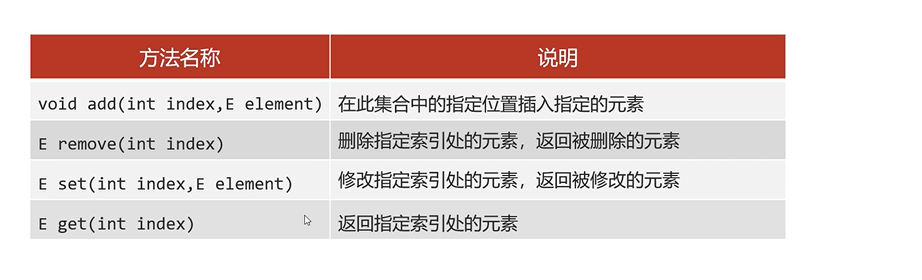

## List
1. 包含集合
	1. ArrayList
	2. LinkedList
	3. Vector
2. 特点
	1. 有序
	2. 有索引
	3. 可重复
3. Collection的方法List都继承了
4. List特有的方法
	
5. List中集合的遍历方式
	1. 迭代器遍历（需要删除元素的时候）
	2. 列表迭代器遍历（需要添加元素的时候）
	3. 增强for遍历（仅仅想遍历的时候）
	4. lambda表达式遍历（同上）
	5. for循环遍历（遍历并且想要操作索引的时候）