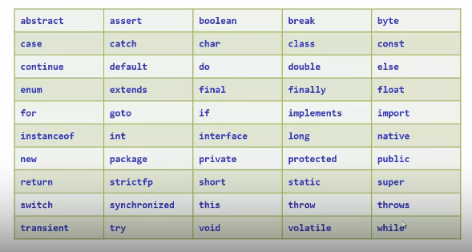

# 关键字
1. 关键字的字母全部小写
	
# 常量
1. 在程序执行过程中值不会改变的量
2. 分类
	1. 整数常量：所有整数
	2. 小数常量：所有小数
	3. 字符常量：被单引号引用的内容，内部只能存放一个字符
	4. 布尔常量：判断t或者f
	5. 空常量：null
**==Ctrl+D==可以复制本行到下一行**
**==psvm==可以直接生成public system void main（String【】 args）{}
==sout==可以直接生成Sytem.out.println（）；**
# 进制
1. 计算机中存储数据的单位：**字节**（1位bit就是一个二进制位，8位bits等于1字节byte，1000字节bytes等于1kb，1024kb等于1mb，1024mb等于1gb
2. 二进制 ：使用0和1开表示，逢二进一，借一当二
3. 八进制：0——7数字进行表示
4. 十六进制：0——9和a——f表示
5. 进制转换：系数^基数的权次幂 相加。其中，系数指每一位上的数，几进制基数就是多少，权是从数值的右侧从0开始逐项+1
	*  例：二进制100=0 * 2 ^ 0 +0 * 2 ^ 1+1 * 2 ^ 2=4
6. 计算机内运算过程：十进制转换成二进制后进行运算，最后转换成十进制输出
7. 书写格式
	 * 十进制：默认格式
	 * 八进制：0开头
	 * 二进制：0b/0B开头
	 * 十六进制：0x/0X开头
# 变量
1. 定义：内存中的存储空间中经常发生改变的数据
2. 定义格式：数据类型 变量名=数据值；
3. Debug工具：供调试的工具，用来查看程序的执行流程，追踪程序执行过程
	1.   断点标记时需要以debug模式运行
	2. 达到断点后F8（step over）继续运行下一步
	3. 控制台显示正在进行的操作，variables显示已有数据值
	4. ctrl+f2可以终止断点，点击重叠双红球可以删除所有断点
4. 注意事项：
	1. 变量名不允许重复
	2. 一条语句可以定义多个变量
	3. 变量在使用前一定要进行赋值
# 标识符
1. 定义：给类、方法、变量等起名字的符号 
2. 命名规则：由数字、字母、下划线、和$组成
3. 不能以数字开头
4. 不能是关键字
5. 区分大小写
6. 小驼峰命名：当是一个单词的时候，首字母小写；多个单词组合的时候，第一个单词首字母小写，其他单词首字母大写
7. 大驼峰命名：也可以一个单词的时候首字母大写，多个单词的时候每个单词的首字母大写
# 数据类型
1. 基本数据类型：
	1. 整数
		1. byte（3位数） 128
		2. short（5位数）
		3. **int（10位数）首选**
		4. long（19位数）==定义long类型的变量的时候，要在数据值之后加入L的标识==
	2. 浮点数
		1. float==定义float类的变量的时候需要在数据值后加上F的标识==
		2. **double** **首选**==无需标识==
	3. 字符
		1. char
	4. 布尔：
		1. boolean
	5. 字符串
		1. String
2. 引用数据类型：
3. 编码表：是计算机中字节到字符中的一套对应关系
4. ASCII表：美国信息交换标准代码
# 键盘录入
1. 引入相关库，必须出现在定义类的上方
	>import java.util.Scanner
2. 使用scanner
	> Scanner ==sc==//可改// = new Scanner（System.in）；
3. 指挥sc键盘录入，定义变量接收数据
	>int age = sc.nextInt();
	>String name = sc.next();

  