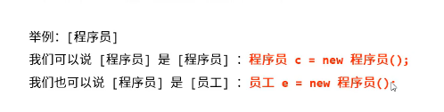

==多态语句使用的时候，能调用什么方法，只看最左边的声明类型，运行期看最右边的实际类型
声明类型用上层接口（如 Collection），是为了在**语法层面做 “共性约束”** —— 强制写通用代码，方便后续切换底层实现类（改一行就行）；而**程序执行的精准性，完全由实际类型（如 ArrayList）保证** —— 调用的共性方法会精准执行该实现类的底层逻辑。这既兼顾了代码的灵活性（方便修改），又保证了执行的准确性（底层逻辑不跑偏），核心是为了 “解耦”，让代码更易维护、扩展。
- 面向对象的三大特征
	- 多态
	- 继承
	- 封装
- 多态：同一个对象在不同时刻表现出来的不同形态
- 
1. 多态的前提和体现
	1. 有继承/实现的关系
	2. 有方法重写
	3. 有父类引用指向子对象
2. 多态的成员访问特点
	1. 成员方法
		1. 编译看左边（父类），执行看右边（子类）
		2. 父类可能是抽象方法，没有逻辑所以执行子类
	2. 成员变量
		1. 编译看左边（父类），执行看左边（父类）
	3. 构造方法
		1. 同继承一样，子类会通过super访问父类构造方法==
3. 多态的好处和弊端
	1. 好处
		1. 精简代码，拥有更多扩展性。定义方法的时候，使用父类类型作为参数，该方法可以接收这父类的任意子类对象
	2. 坏处
		1. 编译只会检查父类方法，对于子类特有的成员方法无法调用
4. 多态中的转型问题
	1. 向上转型
		1. 从子类到父类，小的给大的可以直接给，子类转换到父类类型（也就是强转）
		2. 调用继承体系中公共的方法没有问题，无法调用子类特有的方法 
		3. 多态创建对象后一般只调用公共方法
	2. 向下转型
		1. 从父类到子类，转换回子类类型，需要强转例如Zi z =(Fu) f;
5. instanceof关键字：“谁的实例”