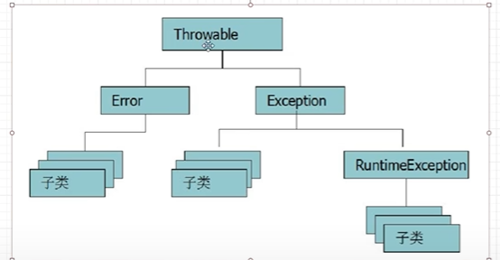
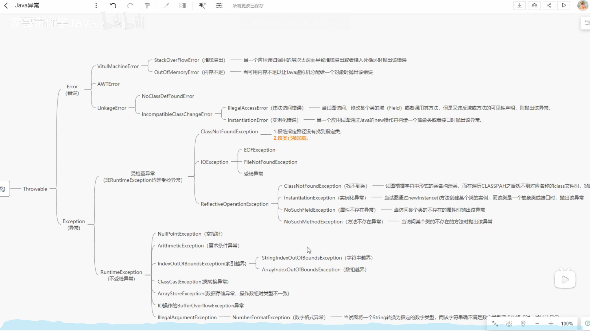
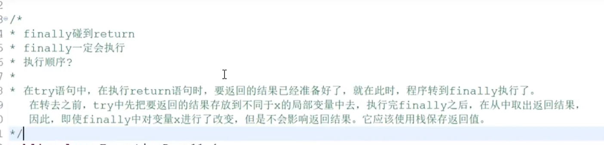

## 程序中的异常
### 1. 定义：指的是在程序的运行过程中发生的不正常der事件或者情况，会中断正在运行的程序
1. 本质：Java当中对可能出现的问题进行描述的一种对象体现运行过程中出现了意想不到的情况，类似于bug
### 2. 常见异常：

1. 两数相除，除数为0（算数异常）——ArithmeticException
2. 空指针异常——NullpointException
3. 数组下标越界——ArrayIndexOutOfBoundsException
4. 类型转换异常——ClassCastException
5. 引用类型没有指定具体实例
6. ……
### 3. 异常的分类
1. 编译异常Exception：程序在编译过程中发现的异常，又称为受检异常；==写代码的时候就该处理掉
2. 运行时异常RuntimeException：又称为非受检异常
3. 实际上，以上两者的**核心区别不在于“什么时候发生”**（因为所有异常都是在运行时才真正抛出的），而在于：

> ==**Java 语言是否强制要求你处理这个异常。**

---

## ✅ 核心区别一句话总结：

|异常类型|是否必须显式处理？|设计意图|
|---|---|---|
|**编译时异常（Checked Exception）**|✅ **必须**（要么 `try-catch`，要么 `throws`）|表示**可预期的、合理的外部问题**，程序应主动应对|
|**运行时异常（Unchecked Exception）**|❌ **不必**（可以不管，程序仍能编译）|表示**程序逻辑错误或 bug**，本应避免发生|

---

### 🔍 关键澄清：**所有异常都是在运行时抛出的！**
4. 错误error：由Java虚拟机生成并抛出的异常，==程序对其不做处理，处理不了
5. **异常之间的关系**：
6. 
### 4.异常的处理
1. 自己处理异常
	1. 通过try hard语句块来处理
		1. 单个异常处理
			1. ==try{==
					==//放置程序可能出问题的代码==	
				==}catch(//可能出现的异常){==
					==//放置1处理异常的代码==
				==}finally{==
					==//释放资源==
				==}==
			2. 捕捉到异常的时候，其实就是new了一个异常的对象，进行了一次实例化
			3. catch中写的异常必须和实际相符合或者说是该异常的父类才能被捕获
		2. 多个异常处理 
			1. 若try语句中有多行代码都有可能出现错误信息，只处理第一个的异常，识别到异常直接跳出匹配catch语句，剩余代码无法被执行以及识别异常
			2. 可以连续写多个catch语句，不限次数。但若是直接加了个父类比如Exception，则这条Exception之后的catch都无法被执行，所以应该放最后
			3. e.printStackTrace();打印具体的异常类别信息，输出错误流并定位，根据这些信息来排查错误

2. 将异常抛出
	1. 在方法后使用throws关键字，谁调用的方法，谁处理被方法抛出的异常。可以在throws关键字后加多个异常类型。然后在调用语句使用try catch语句执行，程序就可以被顺利执行
	2. 如果一个方法声明的是编译时异常，调用的时候必须处理，两种处理方法
		1. 添加try-catch语句
		2. throws抛出异常给调用者
	3. 重写一个方法的时候，它所声明的异常范围不能扩大
	4. 例子：通过throws关键字将异常交给调用者处理（main类还使用throws的话就是交给JVM处理，没有意义）
```Java
package itheima.Exception;  
  
import java.text.ParseException;  
import java.text.SimpleDateFormat;  
  
public class ExceptionDemo05 {  
    public static void main(String[] args) {  
        try {  
            calc();  
        }catch (Exception e){  
            e.getStackTrace();  
        }  
        System.out.println("************");  
    }  
    //throws的使用格式
    public static int calc()throws ArithmeticException{  
        
    }  
}
```
## 5.throw关键字
* 面试题：介绍一下throw throws 和throwable的区别
	 1. throw和throws的区别：
		 1. throws用在方法后，throw用在方法中，跟在异常对象后
		 2. throws后可以跟多个类名（用逗号隔开），throw只能跟一个
		 3. throws表示抛出异常，由方法的调用者来处理；throw表示出异常，由方法内的语句处理
		 4. throws表示出现异常的一种可能性，并不一定发生这些异常；throw则是抛出了具体的异常，真的产生了一个Exception对象
	2. ## 🆚 对比总结表

|特性|`throw`|`throws`|`Throwable`|
|---|---|---|---|
|**类型**|关键字（语句）|关键字（声明）|类（Class）|
|**位置**|方法体内|方法签名后|作为异常类的父类|
|**后面跟什么**|异常**对象**（如 `new IOException()`）|异常**类名**（如 `IOException`）|——|
|**作用**|**抛出**一个具体异常|**声明**可能抛出的异常类型|**所有异常的基类**|
|**数量**|一次只能 `throw` 一个对象|可以 `throws` 多个异常类型（逗号分隔）|——|
|**是否必须**|想主动报错时才用|抛出受检异常时**必须**声明|所有异常天然继承它|
## 5. finally关键字
1. 语法格式：
```Java
		try{
			//放置可能发生异常的代码
		}catch(异常类型 异常名称){
			//放置处理异常的代码
		}finally{
			//释放资源
		}
```
2. finally：
	1. 修饰的代码一定会执行，除非在执行到finally之前程序异常退出或调用了系统的退出方法（不会因为没有捕获到异常就不执行），在try之前调用return会导致try无法被执行进而finally也无法被执行
	2. 只有程序执行了try中的代码，finally就都会执行（前提是try中没有执行system.exit(1);
	3. 经典面试题1
	4. 在finally中是无法改变返回try语句中的结果的
	5. 面试题2：
		1. final finally finalize三者的区别？
		2. 答：final修饰的类不能被继承，修饰的方法不能被重写，修饰的变量变常量；finally是try-catch语句中的一部分，表示要最终执行的一个代码，常用来做资源的示范；finallize是Object中的方法，在垃圾回收的时候要用到的方法
## 6. 自定义异常
1. Java中得异常都是throwable或者exception或者runtimeexception的子类。我们创建一个自定义的异常就是创建其对应的子类
2. 案例：创建一个分数必须在0~100之间的异常，并且使用这个异常