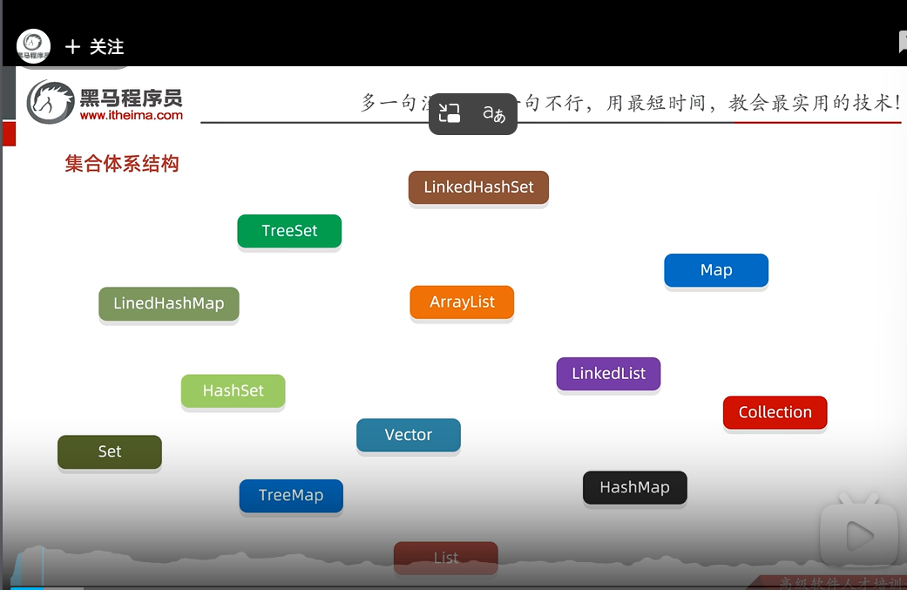
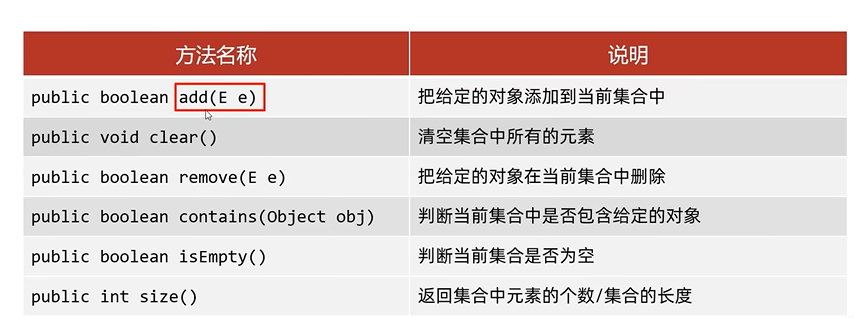

## 单列集合和双列集合
1. 单列集合
	1. 定义：添加数据的时候每次添加一个元素
	2. Collection是父类（接口），其子类
		1. List（接口）：添加的元素是有序（存和取的顺序是一样的）、可重复、有索引
			1. ArrayList
			2. LinkedList
			3. Vector
		2. Set（接口）：添加的元素是无序（存数据的顺序和取的顺序不一样）、不重复（可以进行数据的去重）、无索引
			1. Hashset
				1. LinkedHasset
			2. Treeset
2. 双列集合
	1. 定义：添加数据的时候每次添加一对元素
## Collection基本方法
### Collection是单列集合的祖宗接口，其中的功能是全部单列集合可以继承使用的

1. 接口无法被创建对象，只能用其的实现类创建对象
2. 细节：如果我们要向list集合中添加数据，那么返回值永远返回true，因为其元素允许重复  
3. 细节：若是set，只有不重复的时候才返回true；重复返回false
4. remove方法删除失败的原因：删除的元素根本不存在
5. contains：判断当前的元素是否被集合包含（其实就是依赖eqauls方法遍历所有元素判断，所以如果集合中存储的是自定义对象，也想通过contains方法来判断是否包含，在Javabean类中必须重写equals方法，eqauls方法只看地址不看属性）重写equals直接右键生成就可以
## Collection的遍历方式
1. 迭代器遍历
	1. 获取一个迭代器对象后逐个获取元素。==但并不依赖索引==
	2. 迭代器的类叫==Iterator==，是集合专用的遍历方式
	3. 获取迭代器：Tterrator<E> iterator()；返回迭代器对象。迭代器的对象可以认为是一个指针，指向索引处
		1. boolean hasNext（）；判断当前位置是否有元素
		2. E.next（获取！！！当前！！！位置元素并向后移动指针）
		3. 书写细节
			1. 如果迭代器已经指向空元素，还调用就会报异常NosuchElementException
			2. 迭代器遍历完毕，指针不会复位
			3. 循环中只能调用一次next方法
			4. 迭代器遍历时，不能用集合的方法进行增删
2. 增强for遍历（以前的for循环遍历，需要索引才能遍历，set集合中无索引，无法通过普通for来遍历）
	1. 底层就是一个迭代器，内部原理是一个Iterator迭代器
	2. 所有的单列集合和数组才能用增强for进行便利
	3. 格式：for（元素数据类型 变量名 ：数组或者集合）{执行语句}；
3. Lambda表达式遍历
	1. 在集合中的典型应用
	2. 遍历list.forEach(s -> System.out.println(s));
	3. 过滤 ist.stream()；
		filter(s -> s.startsWith("A")) // 保留以 A 开头的
		forEach(System.out::println);
	4. 转换list.stream()；map(s -> s.toLowerCase()) // 转小写；collect(Collectors.toList());
###  五、注意事项

1. **只能用于函数式接口**
    
    - 接口必须有且仅有一个抽象方法（如 `Runnable`, `Consumer`, `Function`）
    - 常见集合相关接口：
        - `Consumer<T>` → 接收一个参数，无返回（用于 `forEach`）
        - `Predicate<T>` → 接收一个参数，返回 boolean（用于 `filter`）
        - `Function<T, R>` → 接收 T，返回 R（用于 `map`）
2. **不能直接抛出 checked exception**
    
    Java
    
    编辑
    
    ```
    1// 编译错误！
    2list.forEach(s -> throw new IOException()); 
    ```
    
3. **变量捕获限制**  
    Lambda 中使用的外部局部变量必须是 **effectively final**（事实上的 final）：
    
    Java
    
    编辑
    
    ```
    1String prefix = "Item: "; // 隐式 final
    2list.forEach(s -> System.out.println(prefix + s));
    3
    4prefix = "New: "; // ❌ 如果这里修改，上面 Lambda 会报错！
    ```

