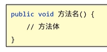
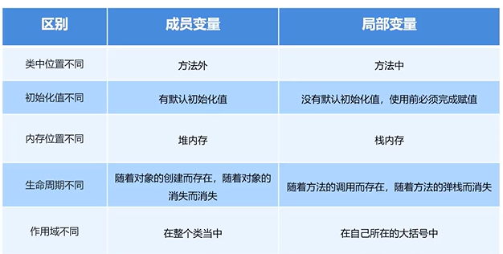
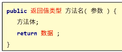
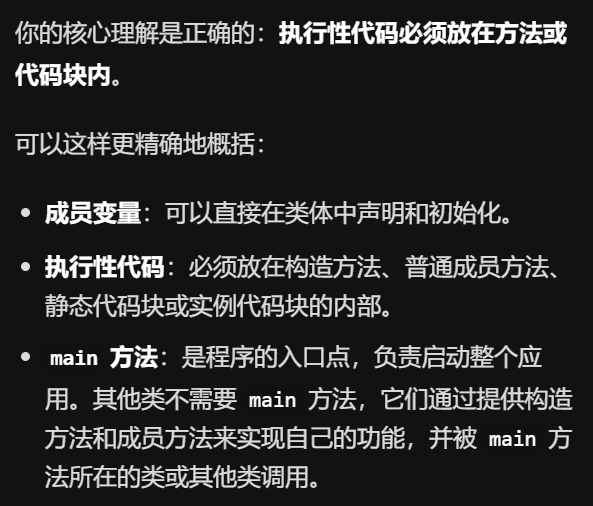

# 类和对象
1. 四句代码绘出窗体
	1. JFame：使用frame.setVisible（true）；使窗口可视化==此行代码必须最后写，不然可能出错==
	2. frame.setSize（）调整大小
2. 面向对象思想
	1. Java代码描述生活中的事物，是通过类（class）的形式
	2. 类的组成
		1. 属性（事物所具有的特征）
			1. 在类中通过成员变量来体现
		2. 行为（事物可能会做的事）
			1. 在类中通过成员方法来体现
		3. 对象：根据类来创建一个或多个对象，**对象是真实存在的事物**
# 成员变量
1. 创建对象：
	1. 类名 对象名 = new 类名（）；`Student stu = new Student；`
	2. **==对象中不需要main函数！在块（{}）中定义的变量是局部变量而不是成员变量，局部变量仅在块中可见==**
	3. 成员变量在方法外，局部变量在方法中
2. 使用对象
	1. 使用成员变量：对象名.变量名；`stu.name`
	2. 打印对象名会告诉你对应的类在哪个包下存放，在内存中的地址（16进制）
3.   成员变量默认初始化值
	1. 整数0
	2. 小数0.0
	3. 布尔false
	4. 字符'\u0000'
	5. 字符串null
4. 引用数据类型：引用、记录了一份地址值的变量 
## 成员方法
1. 定义格式
	1. 
2. 想使用一个类的成员，必须先创建对象
3. 成员方法不被对象调用是不会执行的
4. 方法可以多次调用
5. ==对象内的方法调用顺序就是主函数中的执行顺序，和代码中的编写顺序无关==
6. 方法之间是平级关系，方法之中不可以继续定义方法
7. 方法的作用：
	1. 提高可读性
	2. 提高复用性
8. 方法的调用过程
	1. 对象名其实只是一个变量，记录一个地址值（debug过程中展示的只是idea暂时模拟出的地址）
	2. debug过程中，想查看被调用的方法内如何执行，点击step into按钮；跳出方法点击step out
9. Java内存模型
	1. **堆内存**：保存程序在运行时所产生的对象
	2. **方法区**：存放方法，未调用的时候方法都在这个区域中等待被调用
	3. **栈内存**：保存程序运行时所有方法的执行状态（方法开始运行的时候就会进入此区域）%% 主方法是被虚拟机调用执行的 %%
	4. 本地方法栈：管理一些特殊的方法，被native关键字修饰，存放底层文件
	5. 寄存器：CPU相关
	6. 局部变量（方法中的对象也算局部变量）在所属的方法（方法区或栈内存）当中，成员变量在堆内存中。栈内存中会记录成员方法的地址在堆内存中找到对应空间
10. 成员变量和局部变量的区别
	1. 
11. 带参数的方法
	1. 不给变量赋值，从调用者取值，将参数定义在方法的小括号之中
	2. 定义格式：`public void 方法名(数据类型 变量名){//方法体}`方法定义时，多个参数之间使用逗号分隔
12. 形参和实参
	1. 形式参数：定义方法时所声明的参数，在内存中的体现也只是一份变量而已
	2. 实际参数：调用方法时所传入的参数
13. 带返回值的方法
	1. 有结果产生的方法尽量写成带返回值的方法
	2. 格式：`public 数据类型 方法名(数据类型 变量名){//return 数据值;}`
	3. 在主函数调用 带返回值的方法后，也要定义一个变量进行接受
	4. 调用格式：`数据类型 变量名 = 对象名.方法名（参数）;`
	5. ==我们经常会根据一个方法产生的结果来组织另外一段代码的逻辑==
14. 方法的通用格式
	1. 
		
	2. 明确参数、明确返回值类型（返回值记得return回去）
	3. 调用时，void类型可直接调用，非void类型要用变量接收调用
15. 方法注意事项
	1. 方法不调用就不执行
	2. 方法之间平级关系，不能嵌套定义
	3. 没有返回值的方法（void）可以省略retrun语句。
	4. return语句后不能再写代码（永远无法被执行）
16. 对于成员方法和成员变量和构造方法的理解

## 面向对象应用
1. Jframe窗体对象
	1. setLocationRelativeTo（null）；//设置窗体居中
	2. setAlwayOnTop（true）；//设置窗体置顶
	3. 窗体的关闭不会关闭Java程序。设置关闭模式setDefaultCloseOperation（3）；
2. 方法中调用成员变量
	1. 成员变量和局部变量重名时，优先使用局部变量（就近原则）。可以使用this关键字对成员变量进行区分。格式：this.成员变量名
3. 方法加强
	1. this关键字，就是当前类对象的地址而已     
	2. 哪一个对象调用this，this就能代表那个对象 
	3. 方法中调用成员方法
		1. 方法之间允许相互调用 
		2. 方法之间互相调用可以使用this
	4. 权限修饰符
		1. private
			1. 修饰完后只能在当前类中被访问
			2. 成员变量也可以被修饰
		2. （default）：==默认修饰符==，可以在同一个包、类下进行访问
		3. protected
		4. public ：可以在同一个类、同一个包、不同包之间访问。不同包之间访问的时候，系统会自己导包
	5. 方法重载
		1. 调用方法的时候JVM会通过参数的不同来区分同名的方法，这些同名的方法就构成了重载关系
		2. 只看方法名和参数识别，和返回值无关，参数必须不同
		3. 重载需要在同一个类中
		4. 好处：
			1. 不用记忆过的的繁琐方法名字
			2. sout（）就是一个重载的方法
	6. 构造方法
		1. 构建创造对象的时候所调用的方法
		2. 格式
			1. 方法名与类名相同，大小写一致
			2. 没有返回值类型，连void都没有
			3. 没有具体返回值
		3. 创建对象的时候系统自动调用执行，每创建一个对象就调用一次
		4. 不允许手动调用构造方法，只能创建对象的时候系统调用
		5. 作用
			1. 最大作用：创建对象
			2. 给对象的数据（成员变量）进行初始化
		6. 注意事项
			1. 一个类中没有编写过构造方法，系统会提供一个默认的无参数构造方法。编写后不再提供
			2. 构造方法也可以重载
4. 封装
	1. 面向对象三大特征之一（封装、继承、多态）
	2. 隐藏实现细节，仅对外暴露的访问方式（类似排插，只提供接口）
	3. 将代码抽取到方法中，这是对功能的一种封装
	4. 将属性抽取到类当中，这是对数据的一种封装
5. 标准的JavaBean类（封装数据类）
	1. 成员变量：使用private修饰
	2. 构造方法：
		1. 无参：通过空参方法创建对象，通过set方法对变量赋值
		2. 有参：通过有参方法创建对象，创建对象的时候直接赋值
	3. 成员方法：提供每一个成员变量对应的set（变量类型 变量名）/get（）
	4. 可以右键生成快速创建get/set方法以及无参和有参方法
6. 对象在方法中的传递
	1. 对象作为方法的参数进行传递，传递的其实就是该方法记录的地址值
7. 对象作为方法的返回值
	1.    需求
		1. 定义一个StudentTool类
		2. 编写一个get方法，录入信息封装为学生对象并返回信息
		3. 定义一个测试类，创建stutool对象，调用get方法
		4. 从封装好的学生对象中获取学生信息并打印信息
	2. 对象操作的永远都是地址值，无论是作为参数还是作为返回值
	3. 想要调用对象里的方法，需要先创建对象
  