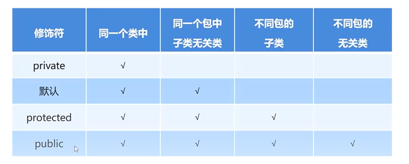
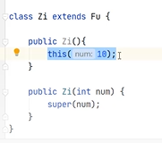

# 继承
1. 让类与类之间产生关系（子父类关系），子类可以直接使用父类中的非私有成员
2. 格式：public class 子类名 extends 父类名（）；
3. ps：一个类文件中可以编写多个类，但一个类文件中只有一个类可以被public修饰
4. 好处：
	1. 提高了代码的复用性
	2. 提高了代码的维护性
	3. 让类与类之间产生了关系，是多态的前提
5. 坏处
	1. 增强了代码的耦合性，管理麻烦
6. 应用场景
	1. 当类之间存在共性内容，并产生了is a的关系，就可以考虑使用继承来优化代码
7. Java只支持单继承，不支持多继承，但支持多层继承
	1. 单继承：子类只能继承一个父类
	2. 不支持多继承：子类不能同时继承多个父类
	3. 多层继承：可以a继承b，b继承c
8. 成员变量
	1. 子父类中出现了重名的成员变量，使用时根据就近原则，优先使用子类的
	2. 使用super.可以访问/调用父类的成员变量
9. 成员方法
	1. 子类继承父类后依旧可以自己继续定义方法（要是重名了也是优先使用子类，其实是子类重写了父类的方法 ）
10. 方法重写（子类对父类的方法覆盖）
	1. 在继承体系中，子类出现了和父类一模一样的方法声明，方法名和参数完全一致
	2. 应用场景
		1. 子类需要父类的功能而子类有自己的特定内容   
	3. 在方法上加入@Override可以检查方法是否是重写（不是的话会报错）
	4. 注意事项
		1. 父类中的私有方法不能被重写
		2. 子类重写父类的时候，访问权限必须大于等于父类
		3. 权限修饰符
			1. 权限修饰符可修饰：成员方法、构造方法、成员变量；
			2. 默认权限：同一个包中子类和无关类都可以访问，不同包下不行
			3. 不同包下的类，经过导入后也可以继承，但方法访问、调用需要拥有相关权限
11. 继承中构造方法的访问特点
	1. super语句可以访问父类的空参构造方法，括号中加入参数可以访问有参
	2. 不太靠谱：使用this（）访问本类的有参构造方法
	3. 
	4. this和super必须放在构造方法的第一行，不能同时出现在方法中共存
	5. 子类是不能继承到父类的构造方法使用的，需要手动重写
12. 继承内存存储结构
13. this和super关键字
	1. this：代表本类对象的引用，访问本类成员方法/成员变量/构造方法
	2. super：代表父类存储空间的表示（父类对象的引用），访问父类成员方法/成员变量/构造方法
	3. 子类在调用父类方法的时候，如果子类没有对父类的方法进行重写，那么super关键字可以省略不写；子类对父类方法进行重写后，不适用super会直接调用本类的方法
14. final关键字
	1. 可以修饰（方法，变量，类）
	2. 表明该量是常量，不能再次被赋值
	3. 表明该方法是最终方法，不能被重写
	4. 表明该类是最终类，不能再拥有子类
	5. 基本数据类型修饰不可更改
	6. 引用数据类型修饰可以通过set方法修改内部属性值
	7. 修饰成员变量的时候，有一个初始化时机的问题
		1. 创建时候直接给值
		2. 在构造方法结束之前完成赋值
15. 常量命名规范
	1. 一个单词：所有字母大写
	2. 多个单词：所有字母大写，词语中间使用_分隔
16. 石头迷阵改进思路
	1. 定义一个类继承JFrame
	2. 将绘制界面的代码抽取为一个单独的方法
	3. 将二维数组提到成员变量的威望值
	4. 可以直接省略JFrame类调用
	5. 将设置窗体的相关代码抽取为一个方法
	6. 在构造方法中调用以上两个方法
	7. 在构造方法区中最后调用setVisible（true）；