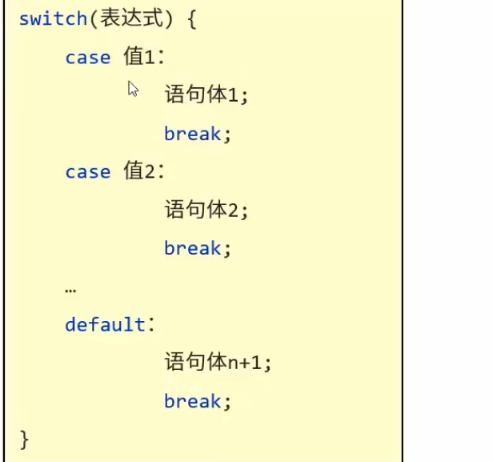

# 分支语句
1. 流程控制
	1. 通过一些语句，来控制程序的执行顺序，包括：
		1. 顺序结构（Java中默认的执行流程）
		2. 分支结构（if、switch）
			1. if语句
				1. `if（关系式）{语句体；}`
				2. `if（关系表达式）{语句体1；}else{语句体2；}`
				3. ``if（关系表达式）{语句体1；}else if（判断条件2）{语句体2；}.......else{语句体n+1；}``
				4. 注意事项：语句体只有一条语句时可以不写大括号；定义变量并指定数据类型看作一条语句；小括号与大括号之间不好写分号
			2. switch语句
				1. 
				2. case的值只能是常量不能是变量
		3. 循环结构（for、while、do……while）